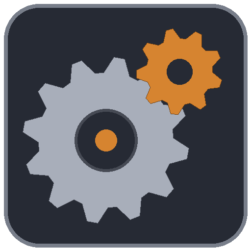

# RotaryCraft (1.21.1, NeoForge)

Realistic mechanical power in Minecraft. Engines make **torque** and **angular speed**; shafts, gearboxes, flywheels, clutches and belts carry them; machines need
a minimum of each. Power is torque times speed, in watts, and it is conserved: gear down for torque, up for speed, and nothing is free.

This is a port of Reika Kalseki's RotaryCraft to Minecraft 1.21.1 on NeoForge, made with Reika's permission. It stands on its own: it needs no other mod.



## What is in it

- **Engines**: DC, AC, wind, steam, gas, performance, hydrokinetic, jet, pneumatic and magnetic engines, the microturbine, an electric motor and generator, a dynamo.
- **Transmission**: shafts and flywheels in five materials, gearboxes (2:1 to 16:1) in six, clutches, shaft junctions, bevel gears, power buses, belts and chains, portal shafts,
  an engine control unit, a dynamometer and the angular transducer to read it all.
- **Processing**: grinder, extractor, blast furnace, friction heater, compactor, centrifuge, fractionation unit, rock melter, pulse furnace, fermenter, crystallizer, dryer,
  composter, refrigerator, boiler, steam turbine, distiller, fuel enhancer, wetter, purifier, grindstone, drop processor, and the worktable and auto-crafter.
- **Fluids**: ethanol, jet fuel, lubricant and liquid nitrogen; pipes, valves, pumps, reservoirs, gas tanks, an aggregator and a spillway.
- **Farming and automation**: sprinklers, fertilizer, ground hydrator, woodcutter, mob harvester, auto-breeder, bait box, fan, item vacuum, sorting machine, item filter,
  scale-able chest, bucket filler and filling station.
- **World and decoration**: flood lights, lamps, light bridge, beam mirror, aerosolizer, firework machine, music box, particle emitter, obsidian maker, pile driver, line builder,
  block filler, self destruct, decorative tanks.
- **Weapons and tools**: cannons, guns, turrets, and the tools and armour of steel and bedrock.
- **Survey and signals**: mob radar, ground-penetrating radar, cave scanner, CCTV, player and smoke detectors, weather controller, terraformer.

Every machine keeps the original's numbers and screens. [docs/MACHINES.md](docs/MACHINES.md) and [docs/MACHINES_WORLD.md](docs/MACHINES_WORLD.md) say what each does.
Recipes use the original's components (base panels, gears, bearings, shaft cores, circuit boards and the rest), and the alloys come from the blast furnace.

## Requirements

- Minecraft 1.21.1, NeoForge 21.1.251 or later.
- Optional: [JEI](https://www.curseforge.com/minecraft/mc-mods/jei) (recipe pages for the processing machines and a description of every machine) and
  [Jade](https://www.curseforge.com/minecraft/mc-mods/jade) (torque, speed, power, tanks and progress on the machine you look at).

## Configuration

All settings are server settings, in the world's `serverconfig` folder (`config` is used on a dedicated server):

- `rotarycraft-server.toml`: shaft failure, explosions breaking blocks, jet engines taking players, watts per Forge Energy, motor and generator buffers, and the ranges of the heat ray, fan,
  vacuum, force field, sonic borer, breeder, bait box, line builder, cave scanner and others.
- `rotarycraft-farm.toml`: the farming machines.
- `rotarycraft-machines.toml`: a switch for each machine that changes blocks or burns things (the pile driver, line builder, block filler, spiller, spillway, self destruct, block cannon and
  firestarter are **off** until you turn them on), and the ranges of lamps, flood lights, light bridges, the aerosolizer and the player detector.
- `rotarycraft-sound.toml`: machine and engine volume.

Block-changing machines ask claim and protection mods (anything that cancels a block break or place event) as their owner, and obey `mobGriefing`.

## Building from source

```
./gradlew build             # the mod jar, in build/libs
./gradlew runGameTestServer # the GameTests, headless
./gradlew runClient         # a development client
```

The art, models and sounds are the original's, converted by the scripts in `tools/` (run `python tools/gen_assets.py` from the repository root; it needs Python 3 and Pillow, and the
original's resources in `reference/RotaryCraft`).

## Credits and licence

RotaryCraft, ReactorCraft and DragonAPI are by Reika Kalseki. This port, for Minecraft 1.21.1, is by Scwunge, with the permission of the original author, and is free: it is not sold
and has no paid or ad-gated releases. The original's copyright is kept in `LICENSE` (MIT).
